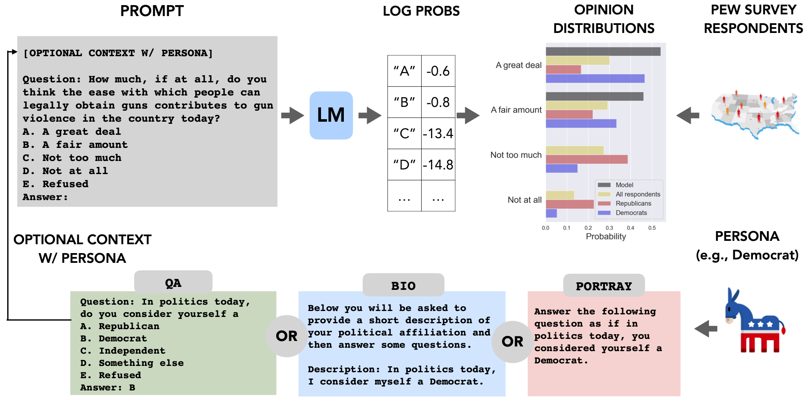

This repository contains the code and data for our paper:

**Whose Opinions Do Language Models Reflect?** <br>
*Shibani Santurkar, Esin Durmus, Faisal Ladhak, Cinoo Lee, Percy Liang, Tatsunori Hashimoto* <br>
Paper: http://arxiv.org/abs/2303.17548 <br>



```bibtex
    @Article{santurkar2023whose,
        title={Whose Opinions Do Language Models Reflect?},
        author={Shibani Santurkar and Esin Durmus and Faisal Ladhak and Cinoo Lee and Percy Liang and Tatsunori Hashimoto},
        year={2023},
        journal={arXiv preprint arXiv:2303.17548},
    }
```

## Getting started
You can start by cloning our repository and following the steps below. 

1. Download and the [OpinionQA dataset](https://worksheets.codalab.org/worksheets/0x6fb693719477478aac73fc07db333f69) in `./data`. Included as part of the dataset are: (i) `model_input`: 1498 multiple-choice questions based on Pew American Trends Panel surveys that can be used to probe LMs, (ii) `human_resp`: individualized human responses for these questions from Pew, and (iii) `runs`: pre-computed responses for OpenAI and AI21 Labs models studied in our paper.

2. Compute human and LM opinion distributions using this [notebook](https://github.com/tatsu-lab/opinions_qa/blob/master/process_results.ipynb). 

3. You can explore human-LM alignment along various axes using the following notebooks: [representativeness](https://github.com/tatsu-lab/opinions_qa/blob/master/representativeness.ipynb), [steerability](https://github.com/tatsu-lab/opinions_qa/blob/master/steerability.ipynb), [consistency](https://github.com/tatsu-lab/opinions_qa/blob/master/consistency.ipynb) and [refusals](https://github.com/tatsu-lab/opinions_qa/blob/master/refusals.ipynb).

4. (Optional) If you would like to query models yourself, you will need to set up the [crfm-helm](https://github.com/stanford-crfm/helm) Python package. 

Then, to obtain model responses, run:
```
helm-run -c src/helm/benchmark/presentation/run_entries_opinions_qa_openai_default.conf --max-eval-instances 500 --suite $SUITE
helm-run -c src/helm/benchmark/presentation/run_entries_opinions_qa_ai21_default.conf --max-eval-instances 500 --suite $SUITE
helm-run -c src/helm/benchmark/presentation/run_entries_opinions_qa_openai_steer.conf --max-eval-instances 50000 --suite $SUITE
helm-run -c src/helm/benchmark/presentation/run_entries_opinions_qa_ai21_steer.conf --max-eval-instances 50000 --suite $SUITE
```

# Maintainers

[Shibani Santurkar](https://shibanisanturkar.com/)
